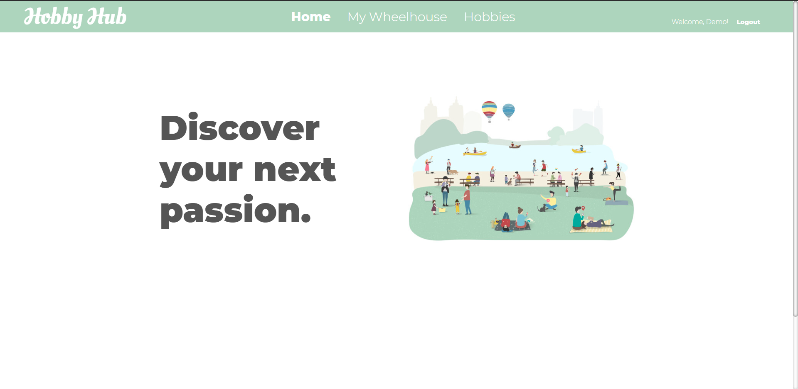
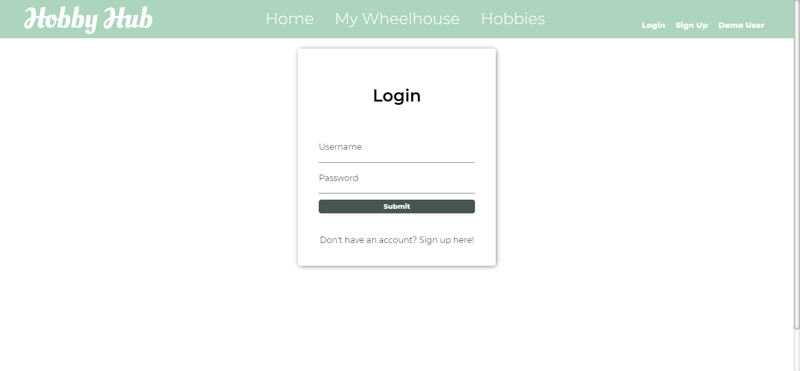
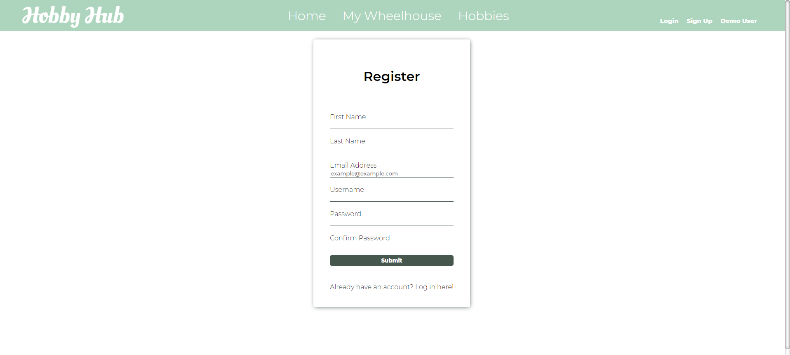
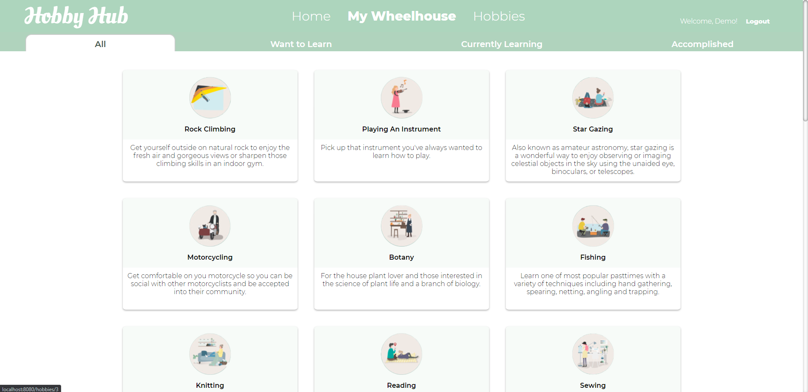
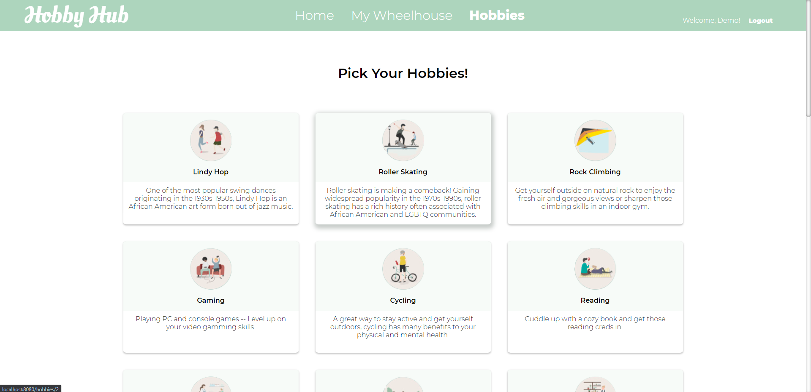
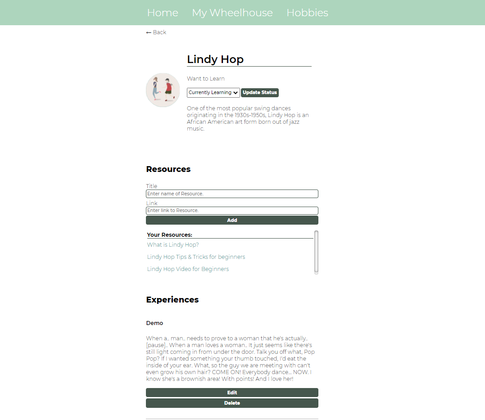
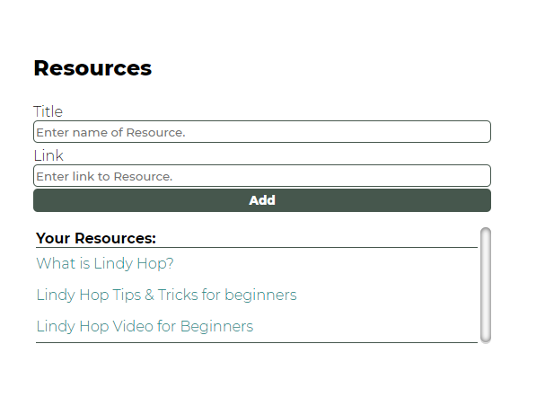
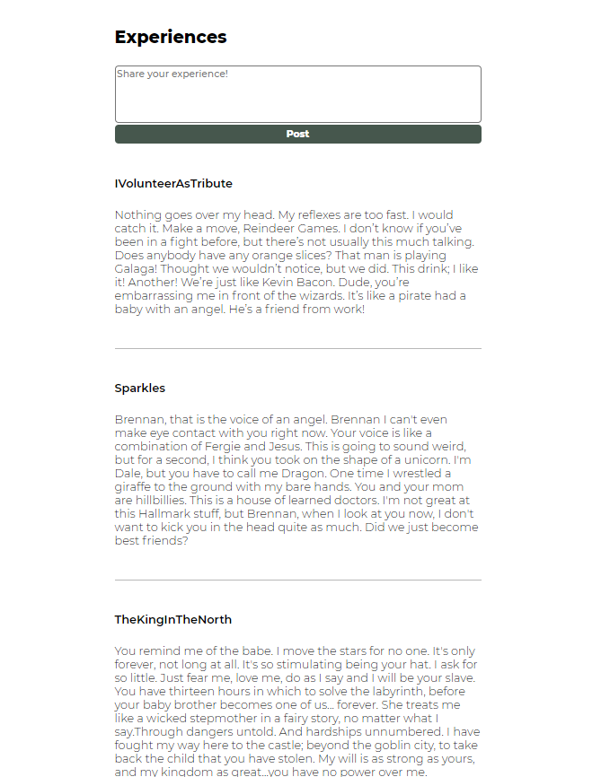

# Hobby Hub

[Hobby Hub Website](https://hobbyhubapp.herokuapp.com/)

[Wiki Pages](https://github.com/dech0n/hobby-hub/wiki)

## Summary

Hobby Hub is a web application where users can discover new hobbies, store their learning resources, and share their experiences. It was inspired by GoodReads and built using Express and JavaScript.

- Create an account
- Log in and Log out
- Log in as a guest via Demo User option
- Discover new hobbies the user might want to learn
- Add and remove hobbies to user Wheelhouse with a status of Want to Learn, Currently Learning, or Accomplished
- Create, read, update, and delete user Experiences on hobbies
- Create, read, and delete private user Resources on hobbies that have been added to their Wheelhouse
- Navigate to user Wheelhouse page to view all hobbies by status
- Navigate to Hobbies page to view all available hobbies
- Navigate to a single hobby page to view all user Experiences and private user resources

## Structure Overview

### Backend

The backend of this app was built using JavaScript and Express utilizing sequelize to interact with a postgreSQL database. The ReSTful convention was followed in all backend API routes.

### Frontend

The frontend of this app was build using JavaScript, Pug, and CSS for styling.

### Libraries Used

- Express
- BCryptjs
- cookie-parser
- csurf
- morgan
- pg
- per-env
- Sequelize

## Primary Features

### User Login and Sign Up

User authentication is handled using Express-Validator as well as BCryptjs for password hashing. When users provide a password at Login, the password is rehashed and checked against the hashed password in the database. When users create an account, the password hashes are saved to the database in lieu of the user passwords.

### My Wheelhouse

The My Wheelhouse page is a single page feature to view all hobbies that the user has added to their wheelhouse grouped by status. AJAX is used to filter hobbies by status. User will be redirected to Login page when attempting to navigate to the My Wheelhouse page if they are not logged in.

### Hobbies

Both registered and unregistered users are able to view all available hobbies on the Hobbies page. User can click on a single hobby card to get redirected to that hobby's page where they can view public user Experiences and logged in users can view their private Resources. Logged in users can add the hobby to their personal wheelhouse using the dropdown status selector.

### Resources

When viewing a hobby, a logged in users can create, view, and delete a list of Resources they have personally added to the hobby.

### Experiences

User Experiences are a way for users to review hobbies they have engaged in. Both registered and unregistered users can view all user Experiences on the selected hobby page. Logged in users can create, edit, and delete their own Experience on the given hobby. Users are limited to one Experience per hobby.

